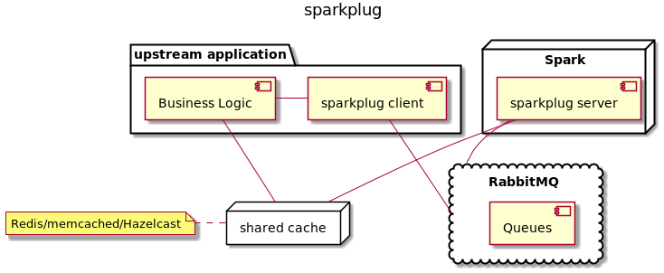

# sparkplug

[](https://travis-ci.org/unchartedsoftware/sparkplug)
[](https://coveralls.io/github/unchartedsoftware/sparkplug?branch=develop)

## about sparkplug

**sparkplug** allows [Apache Spark](https://spark.apache.org/) to act as a near real-time/first-class citizen in an enterprise architecture by exposing Spark via RabbitMQ.



Simply put, you write `PlugHandler` classes that are triggered based on `commands`, allowing multiple tasks to be embedded in one library.  The `PlugClient` allows for an easy way to submit jobs to the server.  One of the easiest ways to get data between the two systems is to have the Spark job output to a shared cache, which the business logic can then access once the `PlugClient` response is handled.

#### using sparkplug

To achieve this goal, one creates a custom library that includes `sparkplug-server`, then:

1. Implement `PlugHandler` as many times as you want; each `PlugHandler` registers to listen for a specific `command` (a string tag to allow different messages to have different actions)
1. Get a handle to the `Plug` object and register the various `PlugHandler` implementations

    ```scala
    val plug = Plug.getInstance()
    plug.connect()
    plug.registerHandler("test", plugHandler)
    ```

1. Tell the `Plug` to start consuming messages!

    ```scala
    plug.run()
    ```

1. When you are done with the `Plug`, clean up nicely via `shutdown()`

Compile the JAR, use `spark-submit` to load it, and you will now be able to have Spark fire off jobs based on messages from a queue.

#### customizing sparkplug

**sparkplug** uses the Typesafe configuration library, and comes with an embedded `reference.conf` with the following defaults:

```hocon
sparkplug {
  master = "spark://localhost:7077"

  inbound-queue = "q_sparkplug"
  outbound-queue = "r_sparkplug"
}

amqp {
  addresses = [
    { host = "localhost", port = 5672 }
  ],
  virtual-host = "/",
  username = "guest",
  password = "guest",
  heartbeat = disable,
  timeout = 30000,
  automatic-recovery = true,
  recovery-interval = 5s
  ssl = disable
}
```

These settings are reasonable for development/testing, but are **NOT** viable in production; you really will want to turn SSL/TLS on, ensure heartbeats are working, and use a RabbitMQ cluster.  Similarly, the `sparkplug.master` URL will probably need to be changed.

#### the sparkplug client

The flip-side of having a system that listens to queues is having some other system that is putting messages on the queue and consuming the responses from Spark when a job completes.  You can do this manually, simply invert submit messages to the `listener-queue` and then listen for responses on the `outbound-queue`.  However, if this sounds like effort, we've created the `PlugClient` for you!

1. Implement the `PlugResponseHandler` (note: unlike the server where there are multiple handlers per command, there is only one response handler - you can embed the logic to discern what to do internally)
1. Get a handle to the `PlugClient` object and register the `PlugResponseHandler` implementation

    ```scala
    val plugClient = PlugClient.getInstance()
    plugClient.setHandler(handler)
    ```

1. Tell the `PlugClient` to start consuming messages!

    ```scala
    plugClient.connect()
    ```

1. When you are done with the `PlugClient`, clean up nicely via `shutdown()`

## testing sparkplug

Due to the fact that this library requires Spark and RabbitMQ, full integration testing requires running two Docker containers - one with RabbitMQ and another with a mini Spark cluster along with Gradle for testing.

To instantiate the environment, simply run the following:

```
./build_environment.sh /bin/bash
./gradlew clean test
```

## roadmap

1. Better error handling
1. Java-based sparkplug client
1. sparkplug broker that allows one to distribute jobs across multiple clusters
